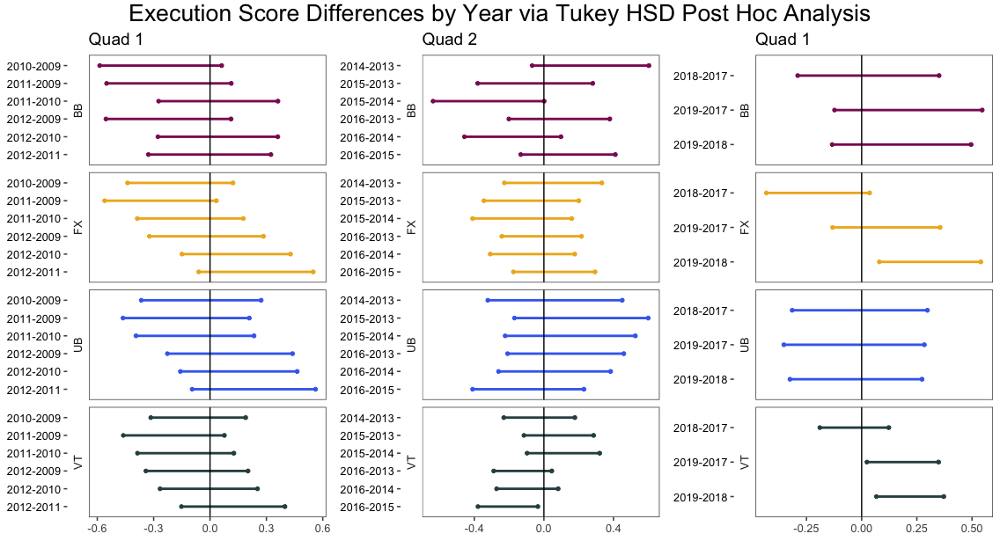

# Elite Gymnastics Scoring Trends

In elite gymnastics, a gymnast’s score is broken up into two components: execution and difficulty. The execution score is out of ten, and can be thought of as a grade of how perfectly the routine was performed. The difficulty score is the summation of the difficulty value of each skill in the gymnast’s routine, and technically has no limit. Two common notions within the gymnastics community are that difficulty scores and execution scores increase as a quad, the four years leading up to the Olympics, progresses. indicating that overall scores increase as well. Using data from the USA gymnastics official website from three different quads: 2009-2012, 2013-2016, and 2017-present, and focusing on American senior elite female gymnasts perfomance at major competitions, I investigate these common notions to find that, while difficulty scores do progress alongside quads, execution scores do not. Additionally, I investigate scoring combinations on each event in combination with gymnast ranking to discover which score component is most beneficial to increase on each individual event -- difficulty or exection -- so that a gymnast could optimize her scores. 
  

Final paper: https://www.bruinsportsanalytics.com/post/elite_gymnastics

  

