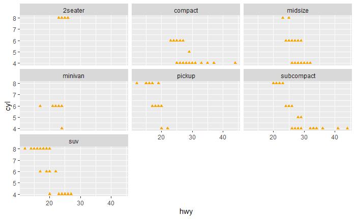

##### Assignment Instructions

In this assignment you will recreate five graphs using ggplot2 and the mpg dataset. You will need to run the code block for each question to view the graph you will need to reproduce. 

After completing the assignment, knit your document, and download both your .Rmd and knitted output. Upload your files for peer review. 

For each response, include comments detailing your response and what each argument in the ggplot function does. 


##### Question 1.

```{r question-1}
## RUN TO VIEW THE GRAPH YOU WILL NEED TO REPRODUCE 

knitr::include_graphics("images/question-1.png")
```

```{r question-1-response}

```

##### Question 2.

```{r question-2}
## RUN TO VIEW THE GRAPH YOU WILL NEED TO REPRODUCE 

knitr::include_graphics("images/question-2.png")
```

```{r question-2-response}

```

##### Question 3.

```{r question-3}
## RUN TO VIEW THE GRAPH YOU WILL NEED TO REPRODUCE 

knitr::include_graphics("images/question-3.png")
```

```{r question-3-response}

```

##### Question 4.

```{r question-4}
## RUN TO VIEW THE GRAPH YOU WILL NEED TO REPRODUCE 

knitr::include_graphics("images/question-4.png")
```

```{r question-4-response}

```

##### Question 5.

```{r question-5}
## RUN TO VIEW THE GRAPH YOU WILL NEED TO REPRODUCE 


```

```{r question-5-response}

```